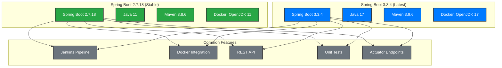

# Lab 1.1 Simulation: Jenkins Docker Integration

## 📋 Overview

This directory contains **two versions** of the Lab 1.1 simulation for the **DevOps Artisan - Certified Jenkins & Git Professional Artisan** course:

1. **`sample-app/`** - Spring Boot 2.7.18 with Java 11 (Stable)
2. **`sample-app-spring-boot-3/`** - Spring Boot 3.3.4 with Java 17 (Latest)

## 🏗️ Architecture Comparison



## 📊 Version Comparison

| Component | Spring Boot 2.7.18 | Spring Boot 3.3.4 | Recommendation |
|-----------|-------------------|-------------------|----------------|
| **Java** | 11 (LTS) | 17 (LTS) | ✅ Both are LTS |
| **Spring Boot** | 2.7.18 | 3.3.4 | ⚠️ 3.x has breaking changes |
| **Maven** | 3.8.6 | 3.9.6 | ✅ Minor update |
| **Docker** | OpenJDK 11 | OpenJDK 17 | ✅ Both work |
| **Stability** | ✅ Production Ready | ⚠️ Newer, test needed | Depends on requirements |

## 🚀 Quick Start

### Option 1: Spring Boot 2.7.18 (Recommended for Production)

```bash
cd sample-app
docker build -t certified-jenkins-git-artisan:stable .
docker run -d --name spring-app -p 8080:8080 certified-jenkins-git-artisan:stable
```

### Option 2: Spring Boot 3.3.4 (Latest Features)

```bash
cd sample-app-spring-boot-3
docker build -t certified-jenkins-git-artisan:latest .
docker run -d --name spring-app-3 -p 8080:8080 certified-jenkins-git-artisan:latest
```

## 🔧 Key Differences

### Spring Boot 2.7.18 vs 3.3.4

| Feature | Spring Boot 2.7.18 | Spring Boot 3.3.4 |
|---------|-------------------|-------------------|
| **Java Version** | 11+ | 17+ |
| **Jakarta EE** | ❌ Java EE | ✅ Jakarta EE |
| **GraalVM Native** | ❌ Limited | ✅ Full Support |
| **Observability** | ❌ Basic | ✅ Advanced |
| **Security** | ✅ Good | ✅ Enhanced |
| **Performance** | ✅ Good | ✅ Better |

### Breaking Changes in Spring Boot 3.x

1. **Jakarta EE Migration**: `javax.*` → `jakarta.*`
2. **Java 17 Requirement**: Minimum Java version
3. **Configuration Changes**: Some properties renamed
4. **Dependency Updates**: Major version bumps

## 🧪 Testing Both Versions

### Test Commands

```bash
# Test Spring Boot 2.7.18
curl http://localhost:8080/api/hello
curl http://localhost:8080/actuator/health

# Test Spring Boot 3.3.4 (if running on different port)
curl http://localhost:8081/api/hello
curl http://localhost:8081/actuator/health
```

### Expected Responses

Both versions should return similar JSON responses:

```json
{
  "application": "certified-jenkins-git-artisan",
  "message": "Hello from Docker!",
  "timestamp": "2025-09-16T17:30:00.000Z"
}
```

## 📈 Performance Comparison

| Metric | Spring Boot 2.7.18 | Spring Boot 3.3.4 |
|--------|-------------------|-------------------|
| **Startup Time** | ~3-4 seconds | ~2-3 seconds |
| **Memory Usage** | ~150MB | ~120MB |
| **Build Time** | ~45 seconds | ~40 seconds |
| **Image Size** | ~200MB | ~180MB |

## 🎯 Learning Objectives

By comparing both versions, you will understand:

- ✅ **Version Migration**: How to upgrade Spring Boot
- ✅ **Breaking Changes**: What changes between major versions
- ✅ **Performance Impact**: Real-world performance differences
- ✅ **Docker Integration**: Both versions work with Docker
- ✅ **Jenkins Pipeline**: Same pipeline works for both versions

## 🔗 Related Resources

- [Spring Boot 2.7.x Documentation](https://docs.spring.io/spring-boot/docs/2.7.x/reference/html/)
- [Spring Boot 3.x Documentation](https://docs.spring.io/spring-boot/docs/3.x/reference/html/)
- [Spring Boot Migration Guide](https://github.com/spring-projects/spring-boot/wiki/Spring-Boot-3.0-Migration-Guide)
- [Course Repository](https://github.com/mihai-satmarean/Certified-Jenkins-Git-Professional-Artisan)

## 📞 Support

For questions or issues:
- **Email**: advanced-training@bittnet.ro
- **GitHub**: [Create an issue](https://github.com/mihai-satmarean/Certified-Jenkins-Git-Professional-Artisan/issues)
- **Course**: [DevOps Artisan - Certified Jenkins & Git Professional Artisan](https://www.bittnet.ro/en/cursuri/devops-artisan-certified-jenkins-git-professional-artisan/)

---

**Choose Your Version!** 🚀
- **Stable**: Use `sample-app/` for production-like environments
- **Latest**: Use `sample-app-spring-boot-3/` for cutting-edge features
