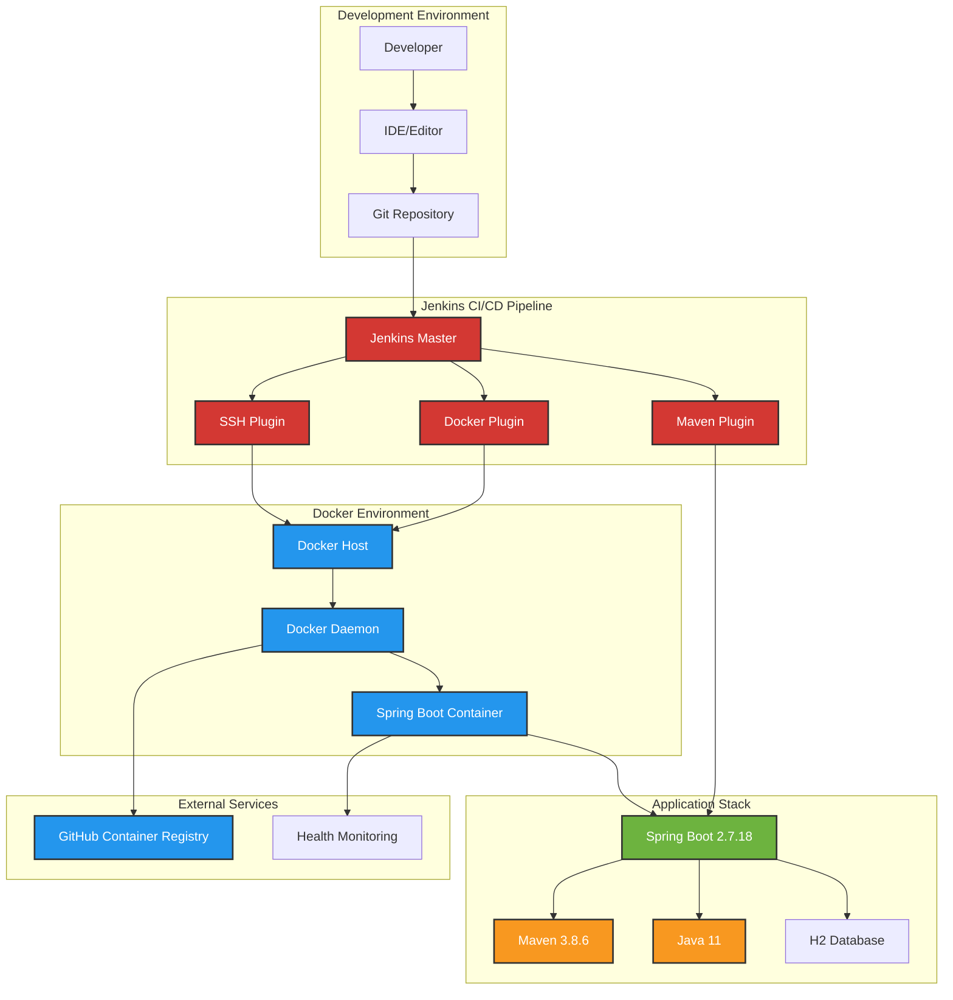

# Lab 1.1 Simulation: Jenkins Docker Integration (Spring Boot 3.x)

## 📋 Overview

This is a simulation of **Lab 1.1: Jenkins Docker Integration** from the **DevOps Artisan - Certified Jenkins & Git Professional Artisan** course. The simulation demonstrates advanced Jenkins integration with Docker, Maven, and Spring Boot.

## 🏗️ Architecture



## 🛠️ Technology Stack

### Core Technologies

| Technology | Version | Purpose | Status |
|------------|---------|---------|--------|
| **Java** | 17 (OpenJDK) | Runtime Environment | ✅ Current LTS |
| **Spring Boot** | 3.3.4 | Application Framework | ✅ Latest |
| **Maven** | 3.9.6 | Build Tool | ✅ Latest |
| **Docker** | Latest | Containerization | ✅ Current |

### Jenkins Plugins

| Plugin | Version | Purpose |
|--------|---------|---------|
| **Docker Plugin** | Latest | Docker integration |
| **SSH Plugin** | Latest | Remote host access |
| **Maven Plugin** | Latest | Maven builds |
| **Pipeline Plugin** | Latest | Pipeline support |

### Dependencies

| Dependency | Version | Purpose |
|------------|---------|---------|
| **spring-boot-starter-web** | 2.7.18 | Web application |
| **spring-boot-starter-actuator** | 2.7.18 | Health monitoring |
| **spring-boot-starter-data-jpa** | 2.7.18 | Database integration |
| **spring-boot-starter-test** | 2.7.18 | Testing framework |
| **h2database** | 2.1.214 | In-memory database |

## 📁 Project Structure

```
sample-app/
├── Dockerfile                 # Multi-stage Docker build
├── Jenkinsfile               # Jenkins pipeline definition
├── pom.xml                   # Maven configuration
├── README.md                 # This file
└── src/
    ├── main/
    │   ├── java/com/example/demo/
    │   │   ├── DemoApplication.java      # Spring Boot main class
    │   │   └── controller/
    │   │       └── DemoController.java   # REST API controller
    │   └── resources/
    │       └── application.properties    # Application configuration
    └── test/
        └── java/com/example/demo/controller/
            └── DemoControllerTest.java   # Unit tests
```

## 🚀 Quick Start

### Prerequisites

- Docker Desktop or Docker Engine
- Java 11+ (for local development)
- Maven 3.8+ (for local development)
- Git

### 1. Clone and Build

```bash
# Clone the repository
git clone https://github.com/mihai-satmarean/Certified-Jenkins-Git-Professional-Artisan.git
cd Certified-Jenkins-Git-Professional-Artisan/lab-simulation/sample-app

# Build Docker image
docker build -t certified-jenkins-git-artisan:latest .
```

### 2. Run Application

```bash
# Run container
docker run -d --name spring-app -p 8080:8080 certified-jenkins-git-artisan:latest

# Test endpoints
curl http://localhost:8080/api/hello
curl http://localhost:8080/api/health
curl http://localhost:8080/actuator/health
```

### 3. Stop and Cleanup

```bash
# Stop and remove container
docker stop spring-app && docker rm spring-app

# Remove image (optional)
docker rmi certified-jenkins-git-artisan:latest
```

## 🔧 Configuration

### Application Properties

```properties
# Server Configuration
server.port=8080
spring.application.name=certified-jenkins-git-artisan

# Actuator Configuration
management.endpoints.web.exposure.include=health,info,metrics
management.endpoint.health.show-details=always

# Database Configuration (H2 in-memory)
spring.datasource.url=jdbc:h2:mem:testdb
spring.datasource.driverClassName=org.h2.Driver
spring.datasource.username=sa
spring.datasource.password=password
spring.h2.console.enabled=true

# JPA Configuration
spring.jpa.database-platform=org.hibernate.dialect.H2Dialect
spring.jpa.hibernate.ddl-auto=create-drop
```

### Docker Configuration

- **Base Image**: `maven:3.8.6-openjdk-11-slim` (build stage)
- **Runtime Image**: `openjdk:11-jre-slim` (runtime stage)
- **Port**: 8080
- **Health Check**: HTTP GET `/actuator/health`

## 🧪 Testing

### Unit Tests

```bash
# Run tests locally
mvn test

# Run tests in Docker
docker run --rm -v $(pwd):/app -w /app maven:3.8.6-openjdk-11-slim mvn test
```

### API Endpoints

| Endpoint | Method | Description | Response |
|----------|--------|-------------|----------|
| `/api/hello` | GET | Hello message | JSON with timestamp |
| `/api/health` | GET | Application health | JSON with status |
| `/actuator/health` | GET | Spring Boot health | Detailed health info |

### Sample Responses

**Hello Endpoint:**
```json
{
  "application": "certified-jenkins-git-artisan",
  "message": "Hello from Docker!",
  "timestamp": "2025-09-16T16:59:07.525843"
}
```

**Health Endpoint:**
```json
{
  "status": "UP",
  "components": {
    "db": {
      "status": "UP",
      "details": {
        "database": "H2",
        "validationQuery": "isValid()"
      }
    },
    "diskSpace": {
      "status": "UP",
      "details": {
        "total": 105088212992,
        "free": 38516043776,
        "threshold": 10485760,
        "exists": true
      }
    },
    "ping": {
      "status": "UP"
    }
  }
}
```

## 🔄 Jenkins Pipeline

The Jenkinsfile implements a complete CI/CD pipeline with the following stages:

1. **Checkout**: Get source code from repository
2. **Build Docker Image**: Multi-stage Docker build
3. **Test Application**: Run Maven tests
4. **Deploy to Container**: Run application in container
5. **Cleanup**: Remove test containers

### Pipeline Features

- **Multi-stage Docker build** for optimized image size
- **Maven integration** for Java builds
- **Health checks** for container validation
- **Automatic cleanup** of test containers
- **Environment variables** for configuration

## 📊 Version Analysis

### Current vs Latest Versions

| Component | Current | Latest | Recommendation |
|-----------|---------|--------|----------------|
| **Spring Boot** | 2.7.18 | 3.2.x | ⚠️ Consider upgrade to 3.x |
| **Maven** | 3.8.6 | 3.9.x | ✅ Minor update available |
| **Java** | 11 | 21 LTS | ⚠️ Consider upgrade to 17/21 |
| **H2 Database** | 2.1.214 | 2.2.x | ✅ Minor update available |

### Upgrade Considerations

1. **Spring Boot 3.x**: Requires Java 17+, breaking changes in configuration
2. **Java 17/21**: Better performance, new language features
3. **Maven 3.9.x**: Performance improvements, bug fixes

## 🎯 Learning Objectives

By completing this simulation, you will understand:

- ✅ **Docker Integration**: Multi-stage builds, health checks
- ✅ **Maven Integration**: Build automation, dependency management
- ✅ **Spring Boot**: REST APIs, Actuator endpoints, testing
- ✅ **Jenkins Pipelines**: Declarative syntax, Docker integration
- ✅ **Container Orchestration**: Docker run, port mapping, cleanup

## 🔗 Related Resources

- [Spring Boot Documentation](https://spring.io/projects/spring-boot)
- [Maven Documentation](https://maven.apache.org/guides/)
- [Docker Documentation](https://docs.docker.com/)
- [Jenkins Pipeline Documentation](https://www.jenkins.io/doc/book/pipeline/)
- [Course Repository](https://github.com/mihai-satmarean/Certified-Jenkins-Git-Professional-Artisan)

## 📞 Support

For questions or issues:
- **Email**: advanced-training@bittnet.ro
- **GitHub**: [Create an issue](https://github.com/mihai-satmarean/Certified-Jenkins-Git-Professional-Artisan/issues)
- **Course**: [DevOps Artisan - Certified Jenkins & Git Professional Artisan](https://www.bittnet.ro/en/cursuri/devops-artisan-certified-jenkins-git-professional-artisan/)

---

**Lab 1.1 Simulation Ready!** 🚀
