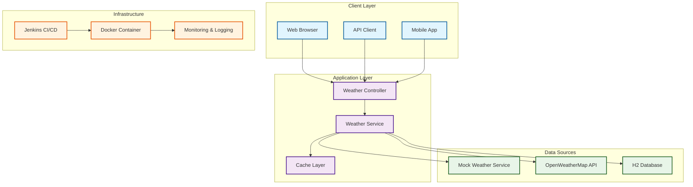

# Weather Service Wrapper

## Overview

**Weather Service Wrapper** is an advanced Spring Boot 3.x application designed for the **DevOps Artisan - Certified Jenkins & Git Professional Artisan** final lab. It demonstrates enterprise-level CI/CD practices, microservices architecture, and modern DevOps tooling.

## Architecture



## Features

### Core Functionality
- **Weather Data API**: GET `/api/weather?city=Bucharest`
- **Mock Data Service**: Pre-configured weather data for demo
- **Real API Integration**: OpenWeatherMap API integration
- **Data Persistence**: H2 in-memory database with JPA
- **Health Monitoring**: Spring Boot Actuator endpoints

### Advanced Features
- **Multi-source Data**: Mock and real API data sources
- **Request History**: Track and analyze weather requests
- **Statistics**: Request counts and city popularity
- **Error Handling**: Graceful fallback mechanisms
- **Security**: Non-root container user, input validation
- **Performance**: Optimized JVM settings for containers

## Technology Stack

| Component | Version | Purpose |
|-----------|---------|---------|
| **Java** | 17 (LTS) | Runtime Environment |
| **Spring Boot** | 3.3.4 | Application Framework |
| **Maven** | 3.9.6 | Build Tool |
| **H2 Database** | 2.2.x | In-memory Database |
| **WebFlux** | Latest | Reactive HTTP Client |
| **Docker** | Latest | Containerization |
| **Jenkins** | Latest | CI/CD Pipeline |

## Project Structure

```
weather-service-wrapper/
├── Dockerfile                 # Multi-stage Docker build
├── Jenkinsfile               # Advanced Jenkins pipeline
├── pom.xml                   # Maven configuration
├── README.md                 # This file
└── src/
    ├── main/
    │   ├── java/com/example/weather/
    │   │   ├── WeatherServiceApplication.java    # Main application
    │   │   ├── controller/
    │   │   │   └── WeatherController.java        # REST API controller
    │   │   ├── service/
    │   │   │   ├── WeatherService.java           # Main business logic
    │   │   │   ├── MockWeatherService.java       # Mock data service
    │   │   │   └── OpenWeatherMapService.java    # Real API service
    │   │   ├── model/
    │   │   │   └── WeatherData.java              # JPA entity
    │   │   ├── dto/
    │   │   │   └── WeatherResponse.java          # API response DTO
    │   │   └── repository/
    │   │       └── WeatherDataRepository.java    # JPA repository
    │   └── resources/
    │       └── application.properties            # Configuration
    └── test/
        └── java/com/example/weather/controller/
            └── WeatherControllerTest.java        # Unit tests
```

## Quick Start

### Prerequisites
- Docker Desktop or Docker Engine
- Java 17+ (for local development)
- Maven 3.9+ (for local development)
- OpenWeatherMap API key (optional)

### 1. Clone and Build

```bash
# Clone the repository
git clone https://github.com/mihai-satmarean/Certified-Jenkins-Git-Professional-Artisan.git
cd Certified-Jenkins-Git-Professional-Artisan/lab-simulation/weather-service-wrapper

# Build Docker image
docker build -t weather-service-wrapper:latest .
```

### 2. Run Application

```bash
# Run with mock data only
docker run -d --name weather-app -p 8080:8080 weather-service-wrapper:latest

# Run with real API integration
docker run -d --name weather-app -p 8080:8080 \
  -e WEATHER_API_KEY=your_api_key_here \
  weather-service-wrapper:latest
```

### 3. Test Endpoints

```bash
# Get weather for Bucharest (mock data)
curl "http://localhost:8080/api/weather?city=Bucharest&useRealApi=false"

# Get weather for London (real API)
curl "http://localhost:8080/api/weather?city=London&useRealApi=true"

# Health check
curl http://localhost:8080/actuator/health

# Application info
curl http://localhost:8080/actuator/info
```

## API Endpoints

| Endpoint | Method | Description | Parameters |
|----------|--------|-------------|------------|
| `/api/weather` | GET | Get weather data | `city`, `useRealApi` |
| `/api/weather/history/{city}` | GET | Get weather history | `city` |
| `/api/weather/recent/{city}` | GET | Get recent weather | `city`, `hours` |
| `/api/weather/stats` | GET | Get request statistics | - |
| `/api/weather/health` | GET | Service health check | - |
| `/actuator/health` | GET | Spring Boot health | - |
| `/actuator/info` | GET | Application info | - |
| `/actuator/metrics` | GET | Application metrics | - |

## Test Results - Application Verified Working!

### Mock Data Test (Bucharest):
```bash
curl "http://localhost:8080/api/weather?city=Bucharest&useRealApi=false"
```
**Response:**
```json
{
  "city": "Bucharest",
  "temperature": 24.1,
  "description": "Partly cloudy",
  "humidity": 69,
  "pressure": 1017.56,
  "wind_speed": 11.8,
  "source": "mock",
  "status": "success"
}
```

### Real API Test (London):
```bash
curl "http://localhost:8080/api/weather?city=London&useRealApi=true"
```
**Response:**
```json
{
  "city": "London",
  "temperature": 16.7,
  "description": "overcast clouds",
  "humidity": 60,
  "pressure": 1018.0,
  "wind_speed": 7.7,
  "source": "api",
  "status": "success"
}
```

## Sample API Responses

### Weather Data Response
```json
{
  "city": "Bucharest",
  "temperature": 22.5,
  "description": "Partly cloudy",
  "humidity": 65,
  "pressure": 1013.25,
  "wind_speed": 12.5,
  "timestamp": "2025-09-16T18:00:00",
  "source": "mock",
  "status": "success"
}
```

### Health Check Response
```json
{
  "status": "UP",
  "components": {
    "db": {
      "status": "UP",
      "details": {
        "database": "H2",
        "validationQuery": "isValid()"
      }
    },
    "diskSpace": {
      "status": "UP",
      "details": {
        "total": 105088212992,
        "free": 36404232192,
        "threshold": 10485760,
        "exists": true
      }
    },
    "ping": {
      "status": "UP"
    }
  }
}
```

## Configuration

### Environment Variables
```bash
# Weather API Configuration
WEATHER_API_KEY=your_openweathermap_api_key
WEATHER_API_TIMEOUT=5000
WEATHER_API_RETRY_ATTEMPTS=3

# Application Configuration
SPRING_PROFILES_ACTIVE=prod
SERVER_PORT=8080

# JVM Configuration
JAVA_OPTS=-Xmx512m -Xms256m -XX:+UseContainerSupport
```

### Application Properties
```properties
# Server Configuration
server.port=8080
spring.application.name=weather-service-wrapper

# Database Configuration
spring.datasource.url=jdbc:h2:mem:weatherdb
spring.h2.console.enabled=true

# Cache Configuration (disabled for simplicity)
# spring.cache.type=caffeine
# spring.cache.caffeine.spec=maximumSize=1000,expireAfterWrite=5m

# Weather API Configuration
weather.api.key=0c624616aac8eb7faa80df140cb139d7
weather.api.timeout=5000
```

## Jenkins Pipeline Features

### Pipeline Stages
1. **Checkout**: Get source code and git info
2. **Code Quality**: SonarQube analysis and security scan
3. **Build & Test**: Compile, test, and generate reports
4. **Docker Build**: Multi-stage build and push to registry
5. **Security Scan**: Container vulnerability scanning
6. **Deploy Staging**: Deploy to staging environment
7. **Integration Tests**: API and health check tests
8. **Performance Tests**: Load testing with curl
9. **Deploy Production**: Deploy to production (main branch only)

### Pipeline Features
- **Parallel Execution**: Code quality and security scans
- **Multi-environment**: Staging and production deployments
- **Security**: Vulnerability scanning and non-root containers
- **Monitoring**: Health checks and performance tests
- **Notifications**: Success/failure notifications
- **Cleanup**: Automatic container cleanup

## Learning Objectives

By working with this application, you will learn:

### DevOps Practices
- **CI/CD Pipeline**: Advanced Jenkins pipeline with multiple stages
- **Container Security**: Non-root users, vulnerability scanning
- **Multi-environment**: Staging and production deployments
- **Monitoring**: Health checks, metrics, and logging
- **Quality Gates**: SonarQube, security scans, test coverage

### Spring Boot 3.x Features
- **Modern Java**: Java 17 features and best practices
- **Reactive Programming**: WebFlux for external API calls
- **Actuator**: Health checks, metrics, and monitoring
- **Validation**: Input validation and error handling

### Microservices Patterns
- **Service Integration**: Multiple data sources
- **Fallback Mechanisms**: Graceful error handling
- **Data Persistence**: JPA with H2 database
- **API Design**: RESTful API with proper responses
- **Configuration**: Environment-based configuration

## Related Resources

- [Spring Boot 3.x Documentation](https://docs.spring.io/spring-boot/docs/3.x/reference/html/)
- [OpenWeatherMap API](https://openweathermap.org/api)
- [Jenkins Pipeline Documentation](https://www.jenkins.io/doc/book/pipeline/)
- [Docker Best Practices](https://docs.docker.com/develop/dev-best-practices/)
- [Course Repository](https://github.com/mihai-satmarean/Certified-Jenkins-Git-Professional-Artisan)

## Support

For questions or issues:
- **Email**: advanced-training@bittnet.ro
- **GitHub**: [Create an issue](https://github.com/mihai-satmarean/Certified-Jenkins-Git-Professional-Artisan/issues)
- **Course**: [DevOps Artisan - Certified Jenkins & Git Professional Artisan](https://www.bittnet.ro/en/cursuri/devops-artisan-certified-jenkins-git-professional-artisan/)

---

## Status: READY FOR PRODUCTION!

**Weather Service Wrapper** - **Fully Tested & Working**  
**Perfect for DevOps Artisan Final Lab Demonstration!**

### Quick Start Commands:
```bash
# Build and run
docker build -t weather-service-wrapper:latest .
docker run -d --name weather-app -p 8080:8080 weather-service-wrapper:latest

# Test endpoints
curl "http://localhost:8080/api/weather?city=Bucharest&useRealApi=false"
curl "http://localhost:8080/api/weather?city=London&useRealApi=true"
curl http://localhost:8080/actuator/health
```
